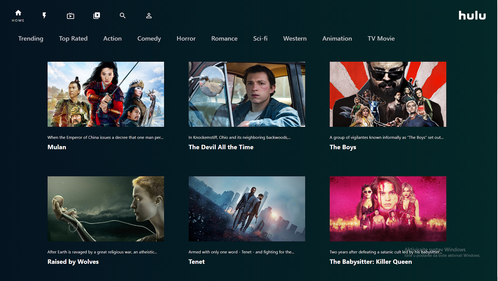

# Hulu Clone


## Project setup

### Clone the project
```
git clone https://github.com/kristijan-kresic-hvar/The-Hulu-Clone.git
```

### Locate your self in the cloned project folder
```
cd hulu-clone
```

### Install the dependecies
```
npm install
```

### Start the dev server
```
npm start
```

### Open your favorite browser
```
url: http://localhost:3000 or 127.0.0.1:3000 if it doesnt open automatically
```